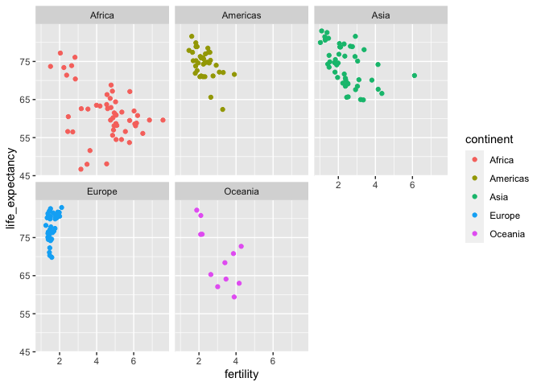
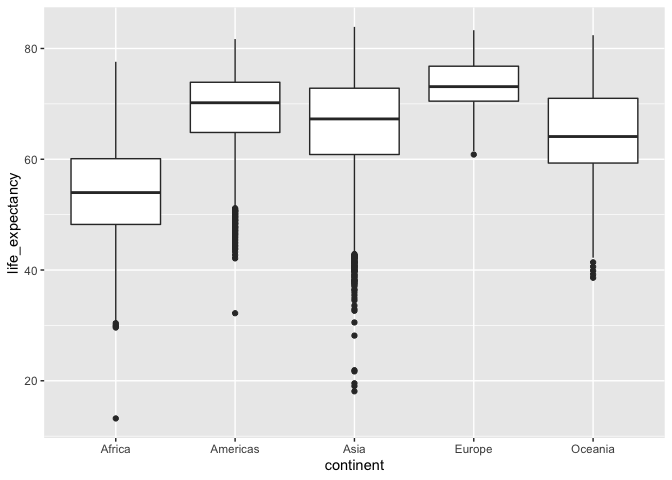
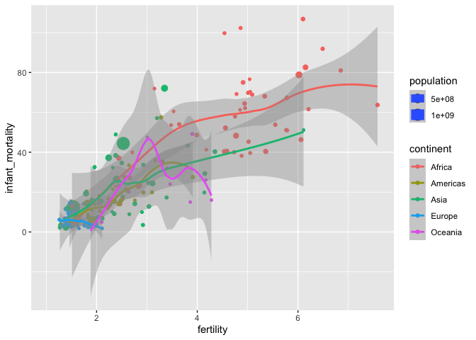
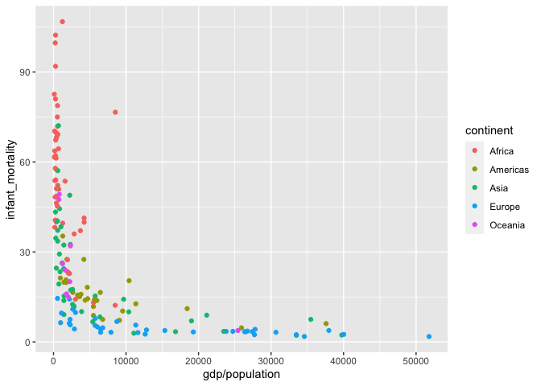

gapminder
================
Nina
2/26/2021

# Data

We’re using ggplot to visually explore global trends in public health
and economics compiled by the [Gapminder
project](https://www.gapminder.org/about/). This project was pioneered
by [Hans Rosling](https://www.ted.com/speakers/hans_rosling), who is
famous for describing the prosperity of nations over time through
famines, wars and other historic events with this beautiful data
visualization in his [2006 TED Talk: The best stats you’ve ever
seen](https://www.ted.com/talks/hans_rosling_shows_the_best_stats_you_ve_ever_seen).

<br> <br>

Loading and subsetting the data:

``` r
library(dslabs) #install.packages("dslabs")
library(tidyverse)

gap2011 <- gapminder %>% 
  as_tibble() %>% 
  filter(year == 2011)
```

# Life expectancy

``` r
ggplot(data = gap2011, mapping = aes(fertility, life_expectancy, color = continent)) +
  geom_point() +
  facet_wrap(~continent)
```

<!-- -->

``` r
ggplot(gapminder) +
  geom_boxplot(aes(continent, life_expectancy))
```

<!-- -->

# Fertility

``` r
ggplot(data = gap2011, mapping = aes(fertility, infant_mortality, color = continent, size = population)) +
  geom_point() +
  geom_smooth()
```

    ## `geom_smooth()` using method = 'loess' and formula 'y ~ x'

    ## Warning: Removed 7 rows containing non-finite values (stat_smooth).

    ## Warning: Removed 7 rows containing missing values (geom_point).

<!-- -->

# Infant mortality

``` r
ggplot(gap2011) +
  geom_point(mapping = aes(x = gdp/population, infant_mortality, color = continent))
```

    ## Warning: Removed 19 rows containing missing values (geom_point).

<!-- -->
